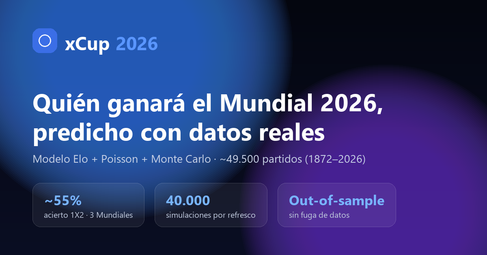
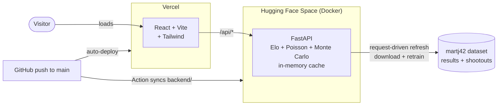

# xCup 2026

[](https://github.com/didadoy/xcup-2026/actions/workflows/ci.yml)
[](https://xcup-2026.vercel.app)

Predicting the **2026 FIFA World Cup** bracket with a statistical model trained on
real data: ~49,500 official international matches (1872–2026). Not a random score
generator — the model is validated **out-of-sample** (retrained without the target
World Cup) and reaches ~55% result (1X2) accuracy across the last three World Cups,
with well-calibrated probabilities.

The web app shows the projection *and* a live **predicted-vs-real** comparison that
updates as matches are played, plus a final retrospective report when the tournament
ends — so it stays meaningful long after the final whistle.

> **Live:** https://xcup-2026.vercel.app



## Features

- **Bracket (Round of 32 → Final).** Once the group stage is over, it starts from the
  real knockout matchups and advances with the **real result** where a match has been
  played, or the model’s favourite where it hasn’t. Each tie shows whether the
  prediction got the matchup right (✓/✗) and marks played matches (score, penalties).
- **Per-match prediction.** Expected goals (xG), 1X2 probabilities and a score
  distribution for any tie.
- **Groups.** Real standings for all 12 groups and a prediction for every match.
- **Favourites.** Each team’s probability of winning the tournament.
- **Accuracy.** Out-of-sample backtest with metrics (1X2, exact score, Brier,
  log-loss), a **reliability diagram**, and validation across the **2018/2022/2026**
  World Cups. Grows and recomputes as the tournament progresses.
- **How it works.** An explainer with interactive charts (Elo evolution, Poisson
  score matrix, champion distribution).
- **Final report.** When the final is played, the home view switches automatically to
  a retrospective: predicted vs actual champion and hit rates by round.
- **Bilingual** (ES/EN) and responsive.

## How the model works

1. **Elo** (World Football Elo Rating System) processed over the full history — K
   varies with tournament importance, goal margin and home advantage.
2. **Attack/defence Poisson** GLM (scikit-learn) with recency and
   tournament-importance sample weights → expected goals and the score matrix.
3. **Monte Carlo** — the remaining bracket is simulated 40,000 times (extra time and
   penalties included); probabilities are frequencies over those runs.

Validation is **honest**: for each World Cup the model is retrained using only matches
played *before* that tournament, so no future information leaks in.

Data source: [martj42/international_results](https://github.com/martj42/international_results)
(`results.csv` + `shootouts.csv`).

## Architecture



The backend precomputes the projection and backtest **in memory**; requests only read
that cache, so it scales to many users. Refresh is **request-driven**: when a request
arrives after a scheduled slot (every 6h), it downloads new results, retrains and
recomputes in the background. State is persisted to disk, with a committed seed
(`backend/data/state_seed.json`) so cold starts never have to simulate to serve.

## Repository layout

```
backend/            FastAPI service (Python)
  main.py           API + request-driven refresh loop
  model.py          Elo + Poisson prediction (loads trained_ratings.json)
  train_model.py    trains Elo + Poisson, writes trained_ratings.json
  wc2026.py         bracket: real vs predicted, penalties, thirds, Monte Carlo
  backtest.py       out-of-sample validation + calibration + multi-World-Cup
  tests/            pytest suite
frontend/           React + Vite + Tailwind SPA
  src/components/   bracket, groups, favourites, accuracy, how-it-works, report
  src/i18n.jsx      lightweight ES/EN i18n (no libraries)
```

## Run locally

Backend (Python 3.12+):

```bash
cd backend
pip install -r requirements.txt
python -m uvicorn main:app --port 8000
```

Frontend (Node 18+):

```bash
cd frontend
npm install
npm run dev
```

Open `http://localhost:5173`. On Windows, `start.ps1` launches both at once.

## Tests

```bash
cd backend
pip install -r requirements-dev.txt
python -m pytest tests/ -q
```

Tests cover the non-trivial logic: probability coherence of the model, group-match
filtering, best-third slot assignment, and penalty-winner inference. CI runs the tests
and a frontend build on every push and pull request.

## Deployment

- **Backend** → Hugging Face Spaces (Docker SDK). A GitHub Action
  (`.github/workflows/deploy-hf-space.yml`) syncs `backend/` to the Space on each push
  to `main` (needs repo secrets `HF_TOKEN` and `HF_SPACE`).
- **Frontend** → Vercel. Root directory `frontend`, env var `VITE_API_URL` pointing to
  the backend URL (no trailing slash).

## Tech stack

| Layer | Tech |
|---|---|
| Frontend | React 18, Vite 6, Tailwind CSS 3 |
| Backend | FastAPI, NumPy, scikit-learn, SciPy |
| Data | Real international results (CSV) |
| CI/CD | GitHub Actions, Vercel, Hugging Face Spaces |

## Disclaimer

A statistical projection for learning and entertainment. Not an official forecast or
betting advice.
