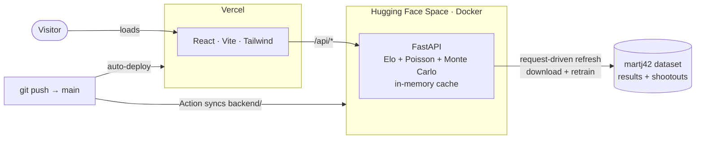

<div align="center">


<h1>xCup&nbsp;2026</h1>

**Predicting the 2026 FIFA World Cup bracket with a statistical model trained on real data.**
Elo&nbsp;+&nbsp;Poisson&nbsp;+&nbsp;Monte&nbsp;Carlo over ~49,500 official international matches (1872–2026).

<p>
<a href="https://github.com/didadoy/xcup-2026/actions/workflows/ci.yml"></a>
<a href="https://xcup-2026.vercel.app"></a>


</p>

### &rarr;&nbsp;[**xcup-2026.vercel.app**](https://xcup-2026.vercel.app)&nbsp;&larr;

</div>

---

## 🏆 The headline

> **The model predicted Spain as champion — its single highest title probability at 25.6% — and Spain won the 2026 World Cup.**
> It also called **59.6%** of all 104 tournament matches (1X2), out-of-sample, with well-calibrated probabilities.

<div align="center">

| Result accuracy (1X2) | Exact score | Brier ↓ | Log-loss ↓ | Champion |
|:---:|:---:|:---:|:---:|:---:|
| **59.6%** | 9.6% | **0.535** | **0.908** | **called ✓** |
| _home 47% · Elo 66%_ | _near chance_ | _no-info 0.667_ | _no-info 1.099_ | _Spain @ 25.6%_ |

</div>

Every number is measured **out-of-sample**: the model is retrained *excluding* the matches it then
predicts, so nothing it forecasts ever influenced its parameters. Across the last three World Cups
(2018 · 2022 · 2026) it averages **~55% 1X2 accuracy over 232 matches**.

## Features

- **Bracket — real vs predicted.** Once the group stage ends it starts from the real knockout
  matchups, advancing with the real result where played (penalties included) or the model's
  favourite where not. Every tie is marked hit ✓ / miss ✗ against the prediction.
- **Final report.** When the final is played the home view becomes a retrospective: predicted vs
  actual champion, and hit rates by round.
- **Favourites — road to the title.** Each team's title probability from 40,000 Monte Carlo runs,
  with a per-round probability sparkline (R16 → Final).
- **Accuracy.** Out-of-sample backtest with a **reliability diagram**, multi-World-Cup validation,
  and the full predicted-vs-real table.
- **How it works.** Interactive charts: Elo evolution, the Poisson score matrix, the champion
  distribution.
- **Bilingual** (ES/EN) · responsive · auto-updating from the live results feed.

## How the model works

| Stage | What it does |
|---|---|
| **Elo** | World Football Elo over the full history; K scales with tournament importance, goal margin and home advantage. |
| **Poisson GLM** | scikit-learn attack/defence per team, weighted by recency and importance → expected goals + score matrix. |
| **Monte Carlo** | the remaining bracket simulated 40,000× (extra time + penalties); probabilities are frequencies. |

Validation is **honest**: for each World Cup the model trains only on matches played *before* that
tournament (walk-forward), so no future information leaks in. Data:
[martj42/international_results](https://github.com/martj42/international_results).

## Architecture



The backend precomputes everything **in memory**; requests only read the cache, so it scales to
many users. Refresh is **request-driven**: on a request past a scheduled slot it downloads new
results, retrains and recomputes in the background — with a committed seed so cold starts never
simulate to serve.

## Repository layout

```
backend/            FastAPI service (Python)
  main.py           API + request-driven refresh loop
  model.py          Elo + Poisson prediction
  train_model.py    trains Elo + Poisson → trained_ratings.json
  wc2026.py         bracket: real vs predicted, penalties, thirds, Monte Carlo
  backtest.py       out-of-sample validation + calibration + multi-World-Cup
  tests/            pytest suite
frontend/           React + Vite + Tailwind SPA
  src/components/   bracket · groups · favourites · accuracy · how-it-works · report
  src/i18n.jsx      lightweight ES/EN i18n (no libraries)
```

## Run locally

```bash
# backend  (Python 3.12+)
cd backend && pip install -r requirements.txt && python -m uvicorn main:app --port 8000

# frontend (Node 18+)
cd frontend && npm install && npm run dev      # → http://localhost:5173
```

On Windows, `start.ps1` launches both at once.

## Tests & CI

```bash
cd backend && pip install -r requirements-dev.txt && python -m pytest tests/ -q
```

Tests cover the non-trivial logic — model probability coherence, group-match filtering, best-third
slot assignment, penalty-winner inference. CI runs the suite **and** a frontend build on every push
and pull request.

## Deployment

- **Backend** → Hugging Face Spaces (Docker). A GitHub Action syncs `backend/` to the Space on each
  push to `main` (repo secrets `HF_TOKEN`, `HF_SPACE`).
- **Frontend** → Vercel. Root `frontend`, env `VITE_API_URL` = backend URL.

## Tech stack

`React 18` · `Vite 6` · `Tailwind CSS 3` · `FastAPI` · `NumPy` · `scikit-learn` · `SciPy` ·
`GitHub Actions` · `Vercel` · `Hugging Face Spaces`

---

<div align="center">
<sub>A statistical projection for learning and entertainment — not an official forecast or betting advice.</sub>
</div>
